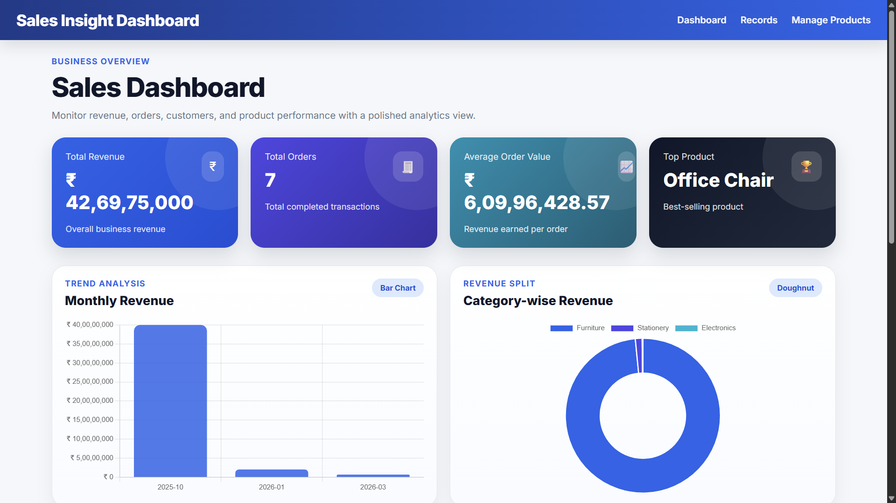
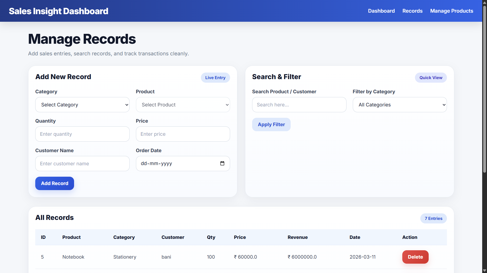

# 📊 Sales Insight Dashboard

A full-stack **Data-Driven Web Application** built using **Flask, SQLite, HTML, CSS, and JavaScript** to manage, analyze, and visualize sales data through an interactive dashboard.

---

## 🚀 Overview

The **Sales Insight Dashboard** is designed to help businesses track sales performance, manage products and categories, and gain actionable insights through dynamic visualizations.

It provides a clean and modern UI with real-time updates and analytics, making it easy to monitor business metrics in one place.

---

## ✨ Features

### 📌 Core Functionalities

* Add and manage **categories and products**
* Record **sales transactions**
* Search and filter records dynamically
* Delete records with validation

### 📊 Dashboard Analytics

* Total Revenue, Orders, and Average Order Value
* Top-performing product
* Monthly revenue visualization
* Category-wise revenue breakdown
* Top customers analysis
* Top products based on quantity sold

### 🎨 UI/UX Highlights

* Modern **premium UI design** with gradients and cards
* Responsive layout for better usability
* Clean table structure and form handling
* Dynamic dropdown (category → product mapping)

---

## 🛠️ Tech Stack

| Layer    | Technology            |
| -------- | --------------------- |
| Frontend | HTML, CSS, JavaScript |
| Backend  | Python (Flask)        |
| Database | SQLite                |
| Charts   | Chart.js              |

---

## 📂 Project Structure

```
SalesInsightDashboard/
│
├── app.py
├── requirements.txt
├── README.md
│
├── static/
│   ├── style.css
│   ├── script.js
│
├── templates/
│   ├── base.html
│   ├── dashboard.html
│   ├── records.html
│   ├── masters.html
│
└── screenshots/
```

---

## 📸 Screenshots

### 🏠 Dashboard



### 🧾 Records Page



### 🛠 Manage Products


---

## ⚙️ Installation & Setup

### 1. Clone the repository

```bash
git clone https://github.com/iashu03/SalesInsightDashboard.git
cd SalesInsightDashboard
```

### 2. Create virtual environment (optional but recommended)

```bash
python -m venv .venv
.venv\Scripts\activate   # Windows
```

### 3. Install dependencies

```bash
pip install -r requirements.txt
```

### 4. Run the application

```bash
python app.py
```

### 5. Open in browser

```text
http://127.0.0.1:5000
```

---

## 🧠 Key Concepts Implemented

* RESTful API design using Flask
* Relational database modeling (SQLite)
* Dynamic frontend updates using JavaScript
* Data aggregation and analytics queries
* Interactive charts using Chart.js
* Clean UI design principles

---

## 📌 Future Enhancements

* User authentication (Login/Register)
* Export reports (PDF / Excel)
* Cloud deployment (Render / AWS)
* Advanced analytics & forecasting
* Role-based access control

---

## 👨‍💻 Author

**Your Name**
GitHub: https://github.com/iashu03

---

## 📄 License

This project is licensed under the **MIT License**.

---

⭐ If you found this project useful, consider giving it a star!
